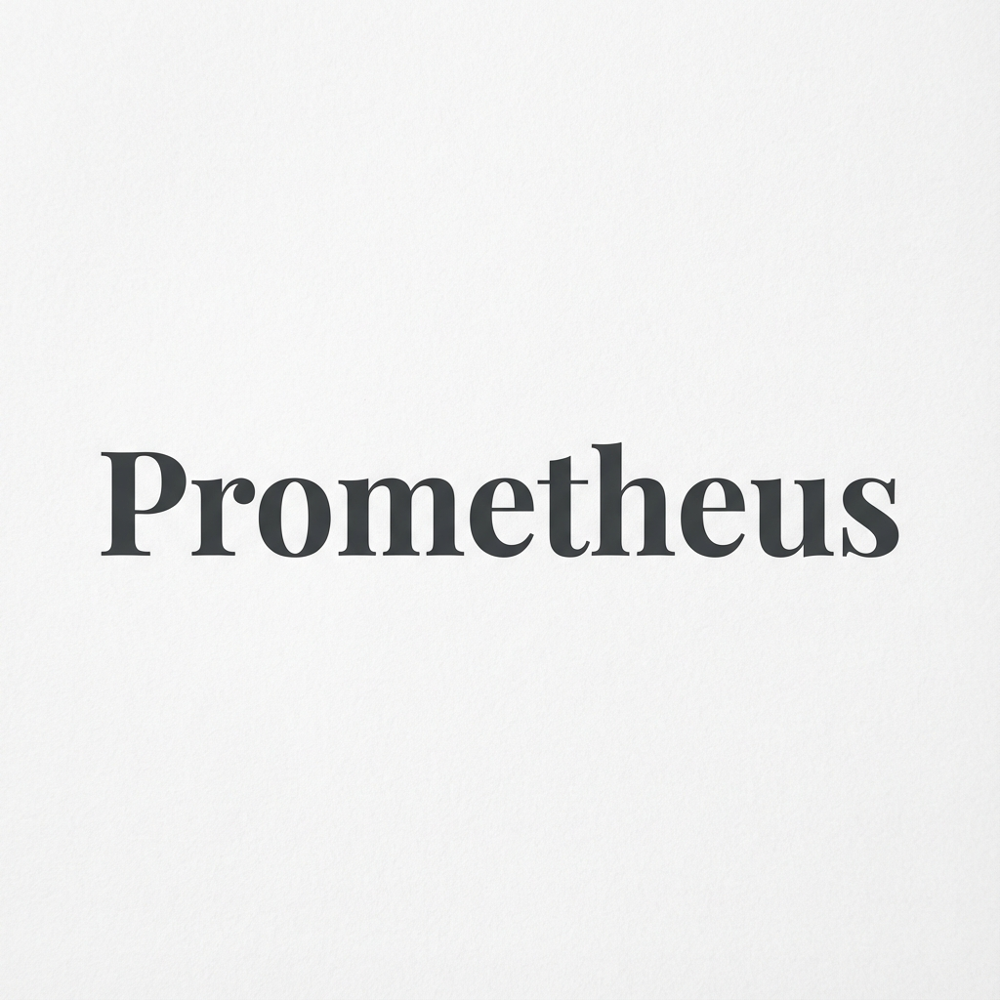

# 
**Architect Intelligent Agents using the System Prompts of Titans.**


## 🚀 Overview
**Prometheus** is an open-source, RAG-powered system prompt engineering engine. It allows developers to generate enterprise-grade system instructions for their AI agents by reverse-engineering the architectural patterns ("DNA") of industry giants like **Google Gemini, OpenAI GPT-4, and Anthropic Claude**.

Instead of guessing how to write a good system prompt, Prometheus uses a **Retrieval-Augmented Generation (RAG)** pipeline to fetch the most relevant "elite" prompt structures from a database of 100+ production system prompts and adapts them to your specific use case.

---

## 🛠️ Tech Stack

### Frontend
<p align="left">
  
</p>

- **Framework**: [React](https://react.dev/) (Vite)
- **Language**: [TypeScript](https://www.typescriptlang.org/)
- **Styling**: [Tailwind CSS](https://tailwindcss.com/) & Vanilla CSS (custom glassmorphism)
- **UI Components**: [Shadcn UI](https://ui.shadcn.com/)
- **Animations**: [Framer Motion](https://www.framer.com/motion/)
- **Auth**: [Clerk](https://clerk.com/)

### Backend
<p align="left">
  
</p>

- **Framework**: [FastAPI](https://fastapi.tiangolo.com/) (Python)
- **Inference**: [Groq](https://groq.com/) (Llama 3 70B)
- **Vector DB**: [Pinecone](https://www.pinecone.io/)
- **Embeddings**: `sentence-transformers/all-mpnet-base-v2`
- **Cloud**: AWS

---

## 🧠 Validated Architecture & Pipeline

Prometheus operation is based on a three-stage "Architectural Synthesis" pipeline:

### 1. Intent Definition & Calibration 🎯
The user starts by describing their agent. The system uses **Groq (Llama-3)** to act as a "Requirements Analyst", instantly analyzing the request and generating 3-4 targeted clarifying questions (e.g., about tone, constraints, edge cases) to refine the user's intent.

### 2. RAG Retrieval & Metadata Filtering 🔍
Once the intent is refined, the system embeds the user's query using **SentenceTransformers**. It then queries a **Pinecone** vector index containing the "DNA" of 100+ best-in-class system prompts.
- **Top-k Retrieval**: We fetch the top 10 most structurally relevant system prompts.
- **Metadata Rich**: Each retrieved prompt contains metadata about its origin (e.g., "Anthropic Claude 3 System Prompt", "Perplexity Search Prompt"), allowing the synthesizer to understand *why* it was retrieved.

### 3. Architectural Synthesis 🧬
The "Architectural Intelligence" engine receives:
- The user's goal.
- Calibrated answers.
- The retrieved "DNA" (structural frameworks) from the elite prompts.

It doesn't just copy; it **synthesizes**. It adapts the *techniques* (e.g., XML tagging from Claude, chain-of-thought enforcement from Gemini) to create a **bespoke, production-ready system prompt** for your specific agent.

---

## 🎨 Key Features & Components

### "Liquid" UI Design
A custom-built design system featuring glassmorphism, fluid animations, and a premium "fintech-dark" aesthetic.

- **Liquid Glass Button**: A custom interactive button component with physics-based shimmer effects.
- **Breathing Orb**: A context-aware loading state that visualizes the AI "thinking" process.
- **Infinite Marquee**: Seamlessly loops through the logos of supported AI models.

### Top Reference Models
We have reverse-engineered patterns from:
<p align="center">
  
  
  
  
  
</p>

---

## 📦 usage

### Prerequisites
- Node.js & npm
- Python 3.9+
- Pinecone API Key
- Groq API Key
- Clerk Publishable Key

### Frontend Setup
```bash
cd prompt-genie
npm install
npm run dev
```

### Backend Setup
```bash
cd backend
pip install -r requirements.txt
uvicorn main:app --reload
```

---

## 📜 License
This project is open-source and available under the MIT License.

## 🤝 Connect
- **LinkedIn**: [Atharva Sawant](https://www.linkedin.com/in/atharvasawant0804/)
- **GitHub**: [Satharva2004](https://github.com/Satharva2004)
